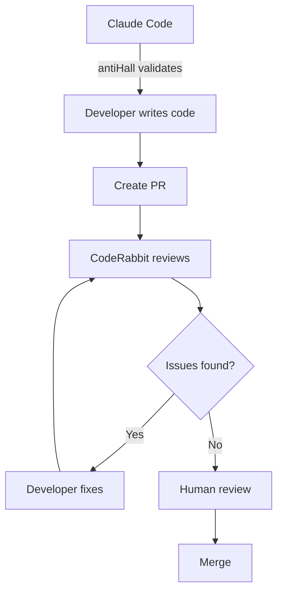

# CodeRabbit Setup Guide for FibreFlow 🐰

## Quick Setup (5 Minutes)

### 1. Install CodeRabbit
```bash
# Go to GitHub Marketplace
https://github.com/marketplace/coderabbitai

# Click "Install" 
# Select "VelocityFibre" organization
# Choose "All repositories" or select "FibreFlow_Firebase"
```

### 2. Create Configuration File
```bash
# In FibreFlow root directory
touch .coderabbit.yaml
```

Add this configuration:
```yaml
# FibreFlow CodeRabbit Configuration
reviews:
  auto_review:
    enabled: true
    branches:
      - "feature/*"
      - "fix/*"
      - "hotfix/*"
    
  path_instructions:
    - path: "src/app/modules/boq/**"
      instructions: |
        - Check calculation accuracy
        - Verify null checks on quantities and prices
        - Ensure proper TypeScript types for IDs
    
    - path: "src/app/modules/suppliers/**"
      instructions: |
        - Validate email formats
        - Check Firebase security rules compliance
        - Verify RFQ workflow logic
    
    - path: "src/app/shared/theme/**"
      instructions: |
        - MUST use CSS variables (--ff-*)
        - No hardcoded colors or spacing
        - Check responsive breakpoints
    
    - path: "**/*.spec.ts"
      instructions: "Ensure comprehensive test coverage"
    
  review_profile: "assertive"
  high_level_summary: true
  
tools:
  github-actions:
    enabled: true
    
integrations:
  github_issues:
    enabled: true
    auto_link: true

chat:
  auto_reply: true
```

### 3. Test CodeRabbit
```bash
# Create a test PR
git checkout -b test/coderabbit-setup
echo "// Test comment" >> README.md
git add . && git commit -m "test: CodeRabbit setup"
git push origin test/coderabbit-setup

# Create PR on GitHub
# Wait 5 minutes for CodeRabbit review
```

## Integration with FibreFlow Workflow

### Complete Review Flow


### What Each Tool Does

| Tool | Purpose | When It Runs |
|------|---------|--------------|
| **antiHall** | Validates code exists | Before writing (Claude) |
| **ESLint** | Style & quality | Pre-commit (local) |
| **CodeRabbit** | Bugs, security, performance | On PR creation |
| **Human** | Business logic, UX | Final review |

## CodeRabbit Commands

### In PR Comments
```bash
# Re-review after changes
@coderabbitai review

# Ask specific questions
@coderabbitai How can I improve the performance of this function?

# Generate documentation
@coderabbitai Please add JSDoc comments to the new methods

# Get suggestions
@coderabbitai What's the best way to handle this error?
```

### Configuration Commands
```bash
# Pause reviews on a PR
@coderabbitai pause

# Resume reviews
@coderabbitai resume

# Get configuration help
@coderabbitai help
```

## Module-Specific Rules

### BOQ Module
CodeRabbit will specifically check:
- Material calculation accuracy
- Stock allocation logic
- Null checks on quantities
- TypeScript branded types usage

### RFQ Module  
CodeRabbit will specifically check:
- Email validation patterns
- Supplier notification flow
- Quote comparison logic
- Firebase security compliance

### Theme Compliance
CodeRabbit will specifically check:
- CSS variable usage (--ff-*)
- No hardcoded values
- Responsive design patterns
- Component styling consistency

## Best Practices

### DO ✅
- Respond to CodeRabbit comments
- Ask for clarification when needed
- Use suggestions to learn
- Configure path-specific rules
- Thank CodeRabbit (it likes that)

### DON'T ❌
- Ignore CodeRabbit warnings
- Merge with unresolved issues
- Disable without team discussion
- Override security warnings
- Argue with the rabbit

## Metrics & ROI

### Track These Metrics
- **Review Time**: Should drop 50-70%
- **Bugs Caught**: 20-30% more than manual
- **PR Cycle Time**: Faster merges
- **Code Quality**: Fewer production issues

### Monthly Review
Check CodeRabbit dashboard for:
- Most common issues
- Review time savings
- Developer engagement
- False positive rate

## Troubleshooting

### CodeRabbit Not Reviewing
1. Check if installed on repository
2. Verify branch name matches config
3. Check GitHub Actions status
4. Review .coderabbit.yaml syntax

### Too Many Comments
1. Adjust review_profile to "balanced"
2. Add path exclusions
3. Configure specific rules

### Integration Issues
1. Check GitHub permissions
2. Verify webhook configuration
3. Contact CodeRabbit support

## Cost Management

### For FibreFlow
- **Start**: 14-day free trial
- **Evaluate**: Track metrics during trial
- **Decide**: Based on time savings and quality improvement
- **Optimize**: Start with Lite plan, upgrade if needed

### ROI Calculation
```
Time saved: 5 hours/week × 4 developers = 20 hours
Cost: $15-30/developer/month
Value: 20 hours × $100/hour = $2000/month saved
ROI: Very positive
```

---

**Remember**: CodeRabbit complements human review, it doesn't replace it. Use it to catch the obvious issues so humans can focus on the complex decisions!