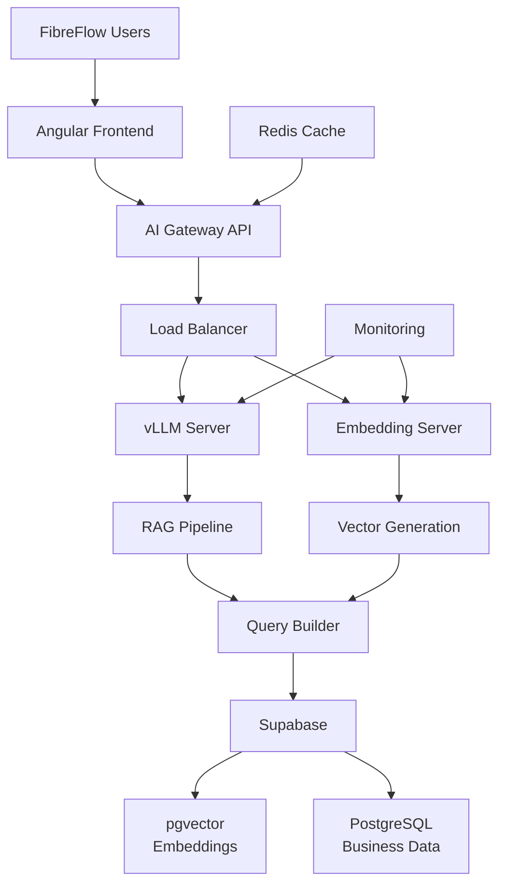

# FibreFlow Self-Hosted LLM Recommendation

*Date: 2025-01-30*  
*Purpose: Final recommendation for self-hosting LLMs for FibreFlow with 50 users*

## Executive Summary

Based on extensive research and the presentation insights on self-hosting LLMs, this document provides a comprehensive recommendation for implementing a self-hosted AI infrastructure for FibreFlow, supporting 50 users with company data interaction capabilities.

## Context & Requirements

### FibreFlow Overview
- **Users**: 50 active users
- **Tech Stack**: Angular 20, Firebase/Firestore, Supabase
- **Use Case**: AI agents for company data interaction
- **Data Types**: Projects, tasks, BOQs, pole tracking, daily progress
- **Infrastructure**: Self-hosted Supabase planned

### Key Insights from Research
1. Self-hosting becomes cost-effective at 50+ users
2. Quantized models retain 99% accuracy with 75% less memory
3. Previous generation GPUs (A100s, RTX 4090s) are perfectly adequate
4. Embedding models MUST be self-hosted to prevent reindexing disasters

## Recommended Architecture

### 1. Model Selection (Start Conservative)

```yaml
Primary Model: Llama 3 70B (4-bit quantized)
- Context: 32K tokens (sufficient for most RAG)
- Performance: Excellent for business queries
- VRAM: ~35GB
- Why: Best balance of capability and resource usage

Embedding Model: BAAI/bge-large-en-v1.5
- Self-hosted (CRITICAL!)
- VRAM: <2GB
- Integrates with Supabase pgvector
- Why: Prevents catastrophic reindexing if external API changes

Fallback Model: Mistral 7B (4-bit)
- For high-load periods
- VRAM: ~4GB
- Why: Maintains service during peak loads
```

### 2. Hardware Recommendation: "Value-for-Money" Tier

```yaml
CPU: AMD Ryzen 9 7950X (16 cores)
- Why: Better value than Intel, excellent multi-threading

RAM: 64GB DDR5
- Why: Handles model loading and concurrent requests

GPU Options:
  Option A: Used RTX A6000 (48GB VRAM) - ~$3,000
  Option B: 2x RTX 4080 Super (16GB each) - ~$2,400
  Recommendation: Option A for simplicity and headroom

Storage: 2TB NVMe SSD
- Why: Fast model loading, ample space for embeddings

Total Cost: ~$4,000-6,000 (with used enterprise GPU)
```

### 3. Software Stack

```yaml
LLM Serving: 
  Production: vLLM
    - Superior batching (continuous batching)
    - Better GPU utilization (80%+ vs 40%)
    - Production-ready features
  Development: Ollama
    - Easy setup and testing
    - Good for prototyping

Orchestration:
  - Docker + Docker Compose
  - Nginx reverse proxy with rate limiting
  - Redis for response caching
  - Prometheus + Grafana for monitoring

AI Framework: LangChain/LangGraph
  - Native Supabase integration
  - Agent workflow support
  - Tool calling capabilities
```

### 4. Supabase Integration Architecture



### 5. Implementation Phases

#### Phase 1: MVP (Month 1)
- **Model**: Mistral 7B quantized
- **Users**: 10 concurrent
- **Features**: 
  - Basic Q&A over projects/tasks
  - Simple embeddings search
  - Response caching
- **Success Metrics**: <2s response time, 95% accuracy

#### Phase 2: Scale (Month 2)
- **Model**: Upgrade to Llama 70B
- **Users**: 25 concurrent
- **Features**:
  - Prefix caching for common queries
  - Agent workflows
  - Advanced RAG with metadata filtering
- **Optimizations**: Continuous batching, SSD caching

#### Phase 3: Optimize (Month 3)
- **Users**: Full 50 user support
- **Features**:
  - Fine-tuning on FibreFlow terminology
  - Multi-modal support (images from pole tracker)
  - Predictive caching
- **Advanced**: A/B testing different models

## Critical Implementation Details

### 1. Embedding Strategy
```python
# NEVER use external embedding APIs
class EmbeddingService:
    def __init__(self):
        self.model = SentenceTransformer('BAAI/bge-large-en-v1.5')
        self.dimension = 1024  # Match pgvector configuration
    
    @cache(ttl=3600)  # Cache for 1 hour
    def embed_text(self, text: str) -> List[float]:
        return self.model.encode(text).tolist()
```

### 2. Caching Strategy
```python
# FibreFlow queries are repetitive - cache aggressively
@cache(ttl=300)  # 5-minute cache
def get_project_summary(project_id: str) -> str:
    context = {
        'project': fetch_project_data(project_id),
        'tasks': fetch_project_tasks(project_id),
        'progress': calculate_progress(project_id)
    }
    
    return llm.generate(
        prompt=PROJECT_SUMMARY_TEMPLATE,
        context=context,
        use_prefix_cache=True  # 7x throughput improvement
    )
```

### 3. Batching Configuration
```yaml
vllm_config:
  continuous_batching: true
  max_batch_size: 32
  batch_timeout_ms: 50
  gpu_memory_utilization: 0.9  # Target 90% GPU usage
```

### 4. Monitoring Setup
```yaml
metrics_to_track:
  - gpu_utilization (target: >80%)
  - request_latency_p95 (target: <2s)
  - tokens_per_second (target: >1000)
  - cache_hit_rate (target: >60%)
  - error_rate (target: <0.1%)
```

## Cost Analysis

### Self-Hosted Total Cost of Ownership
```
Initial Investment:
- Hardware: $5,000 (one-time)
- Setup: 40 hours @ $100/hr = $4,000

Monthly Costs:
- Power/Cooling: $100
- Maintenance: 10 hrs @ $100/hr = $1,000
- Total Monthly: $1,100

Annual TCO: $18,200 (Year 1), $13,200 (Year 2+)
```

### API Provider Comparison
```
GPT-4 Turbo (50 users, moderate usage):
- $3,000-5,000/month
- Annual: $36,000-60,000

Claude 3 Opus:
- $2,500-4,000/month
- Annual: $30,000-48,000

Savings: $15,000-40,000/year after Year 1
```

## FibreFlow-Specific Optimizations

### 1. Domain-Specific Caching
```python
# Cache patterns for FibreFlow's repetitive queries
CACHE_PATTERNS = {
    'project_status': 300,      # 5 minutes
    'pole_locations': 3600,     # 1 hour
    'user_permissions': 1800,   # 30 minutes
    'boq_calculations': 600,    # 10 minutes
}
```

### 2. Workload-Aware Scheduling
```python
# Scale models based on FibreFlow usage patterns
WORKLOAD_SCHEDULE = {
    'business_hours': 'llama-70b',
    'after_hours': 'mistral-7b',
    'weekends': 'mistral-7b',
    'month_end': 'llama-70b'  # Reports period
}
```

### 3. Integration Examples
```python
# Example: Intelligent project analysis
async def analyze_project_health(project_id: str):
    # Gather context from multiple sources
    project_data = await supabase.get_project(project_id)
    task_metrics = await supabase.get_task_metrics(project_id)
    historical_data = await supabase.get_project_history(project_id)
    
    # Use prefix caching for common analysis
    analysis = await llm.analyze(
        template="project_health_analysis",
        context={
            'current': project_data,
            'metrics': task_metrics,
            'history': historical_data
        },
        use_cache=True
    )
    
    return analysis
```

## Risk Mitigation

### 1. Technical Risks
- **GPU Failure**: Keep spare consumer GPU (RTX 4070) for emergency fallback
- **Model Degradation**: Regular evaluation against test sets
- **Scaling Issues**: Cloud GPU burst capacity agreement

### 2. Operational Risks
- **Key Person Dependency**: Document everything, train backup admin
- **Security**: Implement API key rotation, audit logging
- **Compliance**: Regular security audits, data residency verification

## Decision Matrix

| Criteria | Self-Host | API Provider |
|----------|-----------|--------------|
| Cost (Year 2+) | ✅ $13k/yr | ❌ $36k-60k/yr |
| Control | ✅ Full | ❌ Limited |
| Setup Complexity | ❌ High | ✅ None |
| Scalability | ✅ Predictable | ⚠️ Cost scales linearly |
| Data Privacy | ✅ Complete | ❌ Third-party |
| Performance Tuning | ✅ Full control | ❌ Limited |

## Final Recommendation

**Proceed with self-hosting** using the "Value-for-Money" tier configuration. The investment will pay for itself within 6-8 months while providing:

1. **Complete data sovereignty** critical for South African operations
2. **Predictable costs** that don't scale with usage
3. **Performance optimization** specific to FibreFlow workloads
4. **Future flexibility** to adapt models and infrastructure

### Next Steps

1. **Week 1-2**: Procure hardware, focusing on used A6000 GPU
2. **Week 3-4**: Set up base infrastructure with Mistral 7B
3. **Month 2**: Migrate to Llama 70B, implement caching
4. **Month 3**: Fine-tune and optimize for FibreFlow
5. **Ongoing**: Monitor, optimize, and scale as needed

## Appendix: Useful Resources

- [vLLM Documentation](https://vllm.readthedocs.io/)
- [Quantization Guide](https://huggingface.co/docs/transformers/quantization)
- [pgvector Optimization](https://github.com/pgvector/pgvector)
- [LangChain Supabase Integration](https://python.langchain.com/docs/integrations/vectorstores/supabase)

---

*This recommendation is based on current market conditions and technology as of January 2025. Regular review and adjustment recommended.*