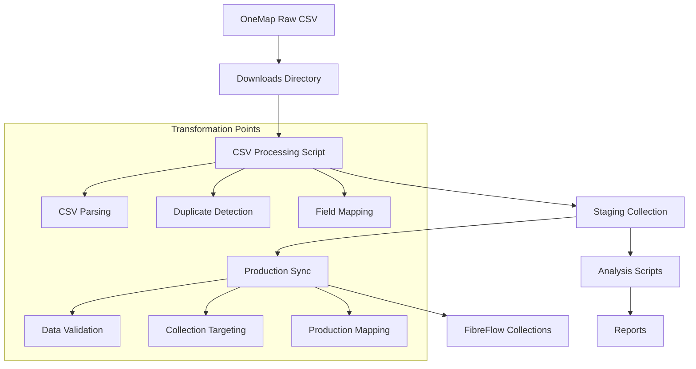

# OneMap Data Lineage Map
*Generated: 2025-07-24*

## Data Flow Overview



## Detailed Data Flow

### Stage 1: Raw Data Ingestion
**Input**: OneMap CSV files
**Location**: `OneMap/downloads/`
**Format**: CSV with ~17 columns
**Volume**: 500,000+ records across 86 files
**Key Fields**: Property ID, Pole Number, Drop Number, Agent, GPS, Status

### Stage 2: CSV Processing 
**Script**: `process-1map-sync-simple.js`
**Input**: Raw CSV files
**Output**: Staging documents in Firestore
**Collection**: `onemap-processing-staging`

**Transformations Applied**:
- Column header normalization
- Date parsing and standardization
- Status categorization
- GPS coordinate validation
- Agent name cleaning
- Duplicate detection logic

**Critical Transformation Points**:
```javascript
// Field mapping
const fieldMapping = {
  'Property ID': 'propertyId',
  'Pole No': 'poleNumber', 
  'Drop No': 'dropNumber',
  'Field Agent Name': 'fieldAgent',
  'Latitude': 'lat',
  'Longitude': 'lng',
  'Status': 'status'
};

// Duplicate detection
const duplicateKey = `${record.propertyId}_${record.poleNumber}_${record.dropNumber}`;
```

### Stage 3: Staging Storage
**Collection**: `onemap-processing-staging`
**Document Structure**:
```javascript
{
  id: "generated_id",
  propertyId: "unique_property_id",
  poleNumber: "LAW.P.A123", 
  dropNumber: "DR1234567",
  fieldAgent: "Agent Name",
  status: "Pole Permission: Approved",
  location: { lat: -26.xxx, lng: 28.xxx },
  importBatch: "batch_id",
  processed: false,
  createdAt: timestamp
}
```

### Stage 4: Analysis Processing
**Scripts**: 116+ analysis scripts
**Input**: Staging collection data
**Output**: Reports and insights

**Key Analysis Types**:
- Duplicate pole assignments
- Agent conflict detection  
- Status change tracking
- GPS-based verification
- Capacity analysis

### Stage 5: Production Sync
**Script**: `sync-to-production.js`
**Input**: Validated staging records
**Output**: Production collections

**Target Collections**:
- `planned-poles` - Pole infrastructure data
- `pole-installations` - Installation tracking

**Mapping Logic**:
```javascript
// Production document structure
const productionRecord = {
  id: generateId(),
  vfPoleId: `VF-${record.poleNumber}`,
  poleNumber: record.poleNumber,
  projectId: "LAW-001", // Lawley project
  location: {
    address: record.address,
    gps: { lat: record.lat, lng: record.lng }
  },
  drops: [record.dropNumber],
  status: mapStatus(record.status),
  assignedAgent: record.fieldAgent,
  source: "onemap-import"
};
```

## Data Integrity Checkpoints

### Checkpoint 1: CSV Parsing
**Validation**: Column headers match expected schema
**Issues**: BOM characters, encoding problems
**Recovery**: Auto-detect encoding, strip BOM

### Checkpoint 2: Duplicate Detection  
**Validation**: Property ID uniqueness
**Issues**: Same property with different pole assignments
**Recovery**: Latest timestamp wins

### Checkpoint 3: Field Validation
**Validation**: Required fields present, GPS coordinates valid
**Issues**: Missing pole numbers, invalid coordinates  
**Recovery**: Flag for manual review

### Checkpoint 4: Production Mapping
**Validation**: FibreFlow schema compliance
**Issues**: Field mapping errors, collection targeting
**Recovery**: Rollback mechanism, error logging

## Critical Data Quality Rules

### Rule 1: Property ID Uniqueness
- **Enforcement**: During CSV processing
- **Logic**: One record per Property ID per batch
- **Exception**: Status updates for same property

### Rule 2: Pole Number Consistency
- **Enforcement**: During staging validation  
- **Logic**: Same pole number should have consistent GPS
- **Exception**: GPS corrections with audit trail

### Rule 3: Drop Number Uniqueness
- **Enforcement**: During production sync
- **Logic**: Each drop assigned to only one pole
- **Exception**: Drop reassignments with approval

### Rule 4: Agent Accountability
- **Enforcement**: During agent analysis
- **Logic**: Agent claims must be verifiable
- **Exception**: Shared poles with clear assignment

## Data Transformation Audit Trail

### Import Tracking
**Collection**: `onemap-processing-imports`
**Purpose**: Track each import batch
**Fields**: source file, record count, processing status, errors

### Change Detection
**Method**: Compare staging records with previous imports
**Tracking**: Field-level changes with timestamps
**Output**: Change reports and delta analysis

### Validation Logs
**Storage**: Processing logs and error collections
**Content**: Failed validations, data quality issues
**Usage**: Debugging and improvement identification

## Known Transformation Issues

### Issue 1: Status Normalization
**Problem**: Inconsistent status strings in source data
**Impact**: Incorrect workflow tracking
**Location**: CSV processing stage

### Issue 2: GPS Precision
**Problem**: Varying coordinate precision across sources
**Impact**: Duplicate detection false positives
**Location**: Field validation stage

### Issue 3: Agent Name Variations
**Problem**: Same agent with different name formats
**Impact**: Payment calculation errors  
**Location**: Agent analysis stage

### Issue 4: Pole Number Formats
**Problem**: Inconsistent pole numbering schemes
**Impact**: Production mapping conflicts
**Location**: Production sync stage

## Recommendations

### Immediate Improvements
1. **Standardize Field Validation**: Consistent rules across all processing stages
2. **Enhanced Logging**: Detailed audit trail for all transformations
3. **Rollback Capability**: Ability to reverse problematic imports
4. **Real-time Monitoring**: Alerts for data quality threshold violations

### Architectural Changes
1. **Single Processing Pipeline**: Replace 116 scripts with unified processor
2. **Schema Enforcement**: Strict schema validation at each stage
3. **Automated Testing**: Validate transformations with test data
4. **Performance Optimization**: Reduce processing time for large files

## Investigation Focus Areas

Based on this lineage map, the investigation should focus on:

1. **CSV Processing Logic**: Where duplicate drops might be created
2. **Staging Validation**: How duplicates pass through to production
3. **Production Mapping**: Collection targeting and field transforms
4. **Analysis Scripts**: Which scripts generate the incorrect reports

The most likely corruption point is during **CSV processing** where field mapping and duplicate detection logic could introduce data integrity issues.