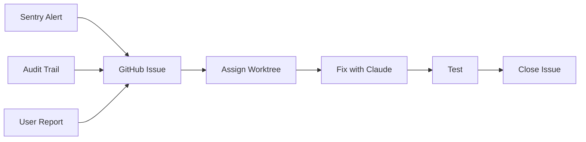
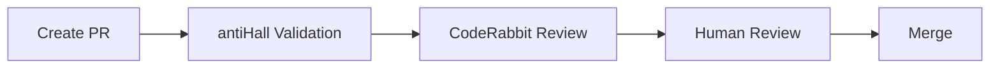
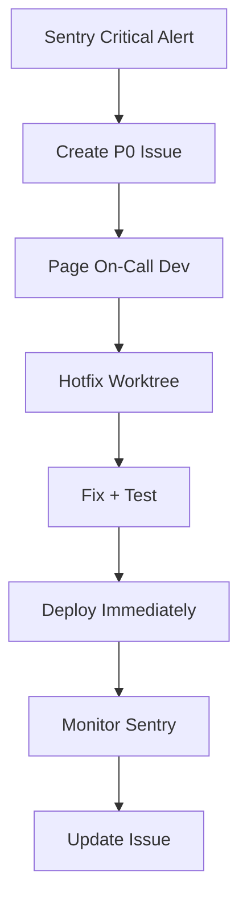

# FibreFlow Testing & Code Review Protocol 📋

## Overview
This document defines the complete testing and review workflow for FibreFlow, integrating Git worktrees, antiHall validation, automated checks, and bug tracking systems.

## 1. Development & Testing Workflow

### A. Starting New Work
```bash
# 1. Check GitHub Issues first
# https://github.com/VelocityFibre/FibreFlow_Firebase/issues

# 2. Choose appropriate worktree based on issue type
cd ~/VF/Apps/FibreFlow-BOQ  # Feature issue
cd ~/VF/Apps/FibreFlow-Hotfix  # Bug issue

# 3. Update antiHall knowledge
cd antiHall && npm run parse:improved

# 4. Start development with Claude (reference issue number)
claude-code "Fix issue #123: [description from GitHub]"
```

### B. Bug Tracking Integration



### C. Issue-Driven Development
```bash
# Working on GitHub issue #123
git checkout -b fix/issue-123-stock-calculation

# Commit referencing issue
git commit -m "fix: Stock calculation error - closes #123"

# This automatically:
# - Links commit to issue
# - Closes issue when merged
# - Updates audit trail
```

## 2. Bug Tracking System

### A. Sentry Integration (Automatic Error Capture)
```typescript
// Errors automatically logged to Sentry with:
- User context
- Error stack trace  
- Browser info
- Feature module
- Firebase UID

// View in Sentry dashboard:
// https://sentry.io/organizations/velocity-fibre/issues/
```

### B. Audit Trail (User Actions)
```typescript
// All actions logged in Firestore:
- User ID
- Action type
- Module affected
- Timestamp
- Changes made

// Query audit trail for issue investigation:
this.auditService.getActionsByUser(userId);
this.auditService.getActionsByModule('boq');
```

### C. GitHub Issues Workflow
```markdown
## Issue Types
- 🐛 bug: Something isn't working
- ✨ feature: New feature request
- 📚 documentation: Documentation improvements
- 🎨 theme: UI/UX consistency issues
- ⚡ performance: Performance problems
- 🔒 security: Security vulnerabilities

## Issue Template
**Module**: BOQ / RFQ / Projects / etc.
**Severity**: Critical / High / Medium / Low
**Steps to Reproduce**:
1. 
2. 

**Expected**: What should happen
**Actual**: What actually happens
**Sentry Link**: [if applicable]
**Audit Trail Reference**: [timestamp/user]
```

## 3. Bug Resolution Workflow

### A. Automated Bug Detection
```bash
# 1. Sentry detects error
# 2. Webhook creates GitHub issue automatically
# 3. Issue tagged with module and severity
# 4. Assigned to relevant developer
```

### B. Manual Bug Reporting
```bash
# 1. User reports bug
# 2. Check audit trail for context
# 3. Create GitHub issue
# 4. Link Sentry errors if found
```

### C. Bug Fix Process
```bash
# 1. Pick issue from GitHub
cd ~/VF/Apps/FibreFlow-Hotfix

# 2. Create branch for issue
git checkout -b fix/issue-123

# 3. Reproduce using audit trail data
# Check audit logs for exact user actions

# 4. Fix with Claude (validates automatically)
claude-code "Fix issue #123 based on Sentry error and audit trail"

# 5. Test fix
npm test -- --include='**/affected/**/*.spec.ts'

# 6. Deploy to hotfix preview
npm run deploy:hotfix

# 7. Update issue with preview link
# "Fixed in preview: https://fibreflow-hotfix.web.app"

# 8. After testing, merge
git commit -m "fix: Resolve stock calculation error

- Fixed calculation logic in BoqService
- Added validation for negative values
- Improved error handling

Closes #123"
```

## 4. Code Review System with Issue Tracking

### A. Automated PR Review with CodeRabbit 🐰

#### Three-Layer Review System:


#### Layer 1: antiHall (Pre-PR)
- Claude validates all code BEFORE PR creation
- Ensures methods/services exist
- Prevents hallucinated code

#### Layer 2: CodeRabbit (Automated on PR)
Within 5 minutes, CodeRabbit checks:
- 🐛 **Bug Risks**: Null checks, edge cases, logic errors
- 🔒 **Security**: Vulnerabilities, exposed secrets, unsafe patterns
- ⚡ **Performance**: Memory leaks, inefficient loops, bundle size
- 🎨 **Code Quality**: Complexity, duplication, naming conventions
- 📚 **Documentation**: Missing JSDoc, unclear logic
- ✅ **Best Practices**: Angular patterns, TypeScript standards

#### Layer 3: Human Review (Final Check)
Focus on:
- Business logic correctness
- Integration with other modules
- UX/UI decisions
- Complex architectural choices

### B. CodeRabbit Configuration for FibreFlow

#### .coderabbit.yaml
```yaml
# FibreFlow CodeRabbit Configuration
reviews:
  auto_review:
    enabled: true
    branches:
      - "feature/*"
      - "fix/*"
      - "hotfix/*"
    
  path_instructions:
    - path: "src/app/modules/boq/**"
      instructions: "Pay special attention to calculation accuracy and null checks"
    - path: "src/app/modules/suppliers/**"
      instructions: "Check for proper email validation and Firebase security"
    - path: "src/app/shared/theme/**"
      instructions: "Ensure all styles use CSS variables, no hardcoded colors"
    
  review_profile: "assertive"  # thorough reviews
  
  tools:
    github-actions:
      enabled: true
    
integrations:
  github_issues:
    enabled: true
    auto_link: true  # Link to GitHub issues mentioned in PR

chat:
  auto_reply: true  # AI responds to developer questions
```

### C. CodeRabbit Workflow Example

#### 1. Developer Creates PR
```bash
git push origin feature/boq-calculations
# Create PR on GitHub
```

#### 2. CodeRabbit Reviews (Automatic)
```
🐰 CodeRabbit Review (5 minutes later):

## Summary
Found 3 issues that need attention:

### 🐛 Potential Bugs (1)
- Line 145: Possible null reference when `item.quantity` is undefined

### ⚡ Performance (1)  
- Line 203: This loop could be optimized using `.reduce()`

### 📚 Documentation (1)
- Missing JSDoc for `calculateTotalCost()` method

### ✅ Approved Aspects
- Proper use of TypeScript types
- Follows Angular style guide
- Good error handling
```

#### 3. Developer Responds
```
@coderabbitai How should I handle the null check on line 145?
```

#### 4. CodeRabbit Suggests
```
You can add a null check like this:
```typescript
const quantity = item?.quantity ?? 0;
```
Or validate at the beginning of the method.
```

### D. PR Template (Enhanced)
```markdown
## Related Issue
Closes #123

## Changes Made
- 
- 

## Testing Done
- [ ] Unit tests added/updated
- [ ] Tested on preview site
- [ ] Sentry errors resolved
- [ ] Audit trail verified

## Checklist
- [ ] antiHall validated (automatic)
- [ ] Theme compliance
- [ ] No new Sentry errors
- [ ] Issue reproduction steps tested
```

### B. Review Focus Based on Issue Type
```bash
# Bug Fix Reviews
- Focus on regression tests
- Verify Sentry error resolved
- Check audit trail for side effects

# Feature Reviews  
- Focus on new test coverage
- Verify audit trail logging
- Check Sentry error handling

# Performance Reviews
- Focus on bundle size
- Verify no new Sentry errors
- Check performance metrics
```

## 5. Monitoring & Metrics

### A. Sentry Dashboard Metrics
```
Track weekly:
- Error rate by module
- Most frequent errors
- User impact (affected users)
- Resolution time

Goal: < 1% error rate
```

### B. GitHub Issues Metrics
```
Track monthly:
- Issues opened vs closed
- Average resolution time
- Issues by module
- Issues by severity

Goal: Close within SLA
- Critical: 24 hours
- High: 3 days  
- Medium: 1 week
- Low: 2 weeks
```

### C. Audit Trail Analysis
```typescript
// Monthly analysis queries
// Find most error-prone workflows
const problemAreas = await this.auditService.analyzeProblemAreas();

// Find users experiencing most issues
const affectedUsers = await this.auditService.getMostAffectedUsers();
```

## 6. Integration with Claude Code

### Claude's Issue-Aware Workflow
```bash
# Reference issue in request
claude-code "Fix issue #123 from GitHub"

# Claude automatically:
1. Reads issue description
2. Checks related Sentry errors
3. Reviews audit trail context
4. Validates fix with antiHall
5. Suggests comprehensive solution
```

### Issue-Driven Prompts
```bash
# For bugs
"Fix issue #123 - check Sentry for error details"

# For features
"Implement issue #456 - new BOQ export feature"

# For investigation
"Investigate issue #789 using audit trail data"
```

## 7. Quick Reference - Issue Management

### Creating Issues
```bash
# From Sentry error
1. Click "Create GitHub Issue" in Sentry
2. Add module label
3. Set severity
4. Assign to developer

# From user report
1. Check audit trail first
2. Create issue with template
3. Link any Sentry errors
4. Add reproduction steps
```

### Working on Issues
```bash
# 1. Pick issue
https://github.com/VelocityFibre/FibreFlow_Firebase/issues

# 2. Create worktree branch
git checkout -b fix/issue-NUMBER

# 3. Fix with Claude
claude-code "Fix issue #NUMBER"

# 4. Test thoroughly
npm test

# 5. Deploy preview
npm run deploy:hotfix

# 6. Update issue
"Fixed in preview: [URL]"
```

### Closing Issues
```bash
# Automatic closing
git commit -m "fix: Description - closes #123"

# Manual closing
- Test in production
- Verify in Sentry (no new errors)
- Check audit trail
- Close with comment
```

## 8. Emergency Response

### Critical Bug Process


### Rollback with Issues
```bash
# If fix causes more problems
1. Revert deployment
firebase hosting:rollback

2. Update issue
"Rolled back - investigating further"

3. Check new Sentry errors
4. Review audit trail for impact
```

## 9. Weekly Issue Review

### Monday Morning Checklist
```bash
# 1. Review weekend Sentry errors
https://sentry.io/organizations/velocity-fibre/

# 2. Check new GitHub issues  
https://github.com/VelocityFibre/FibreFlow_Firebase/issues

# 3. Prioritize for week
- Critical bugs → Hotfix worktree
- Features → Feature worktrees
- Improvements → Backlog

# 4. Update antiHall
cd antiHall && npm run parse:improved
```

## 10. Benefits of Integrated System

### For Development
- Clear issue tracking
- Automatic error capture
- User action context
- Faster debugging

### For Users
- Bugs fixed faster
- Better communication
- Fewer regressions
- Improved stability

### For Management
- Clear metrics
- SLA tracking
- Quality trends
- User impact visibility

---

**Remember**: Every bug is an opportunity to improve. Use Sentry + Audit Trail + GitHub Issues to create a learning system that prevents future issues!