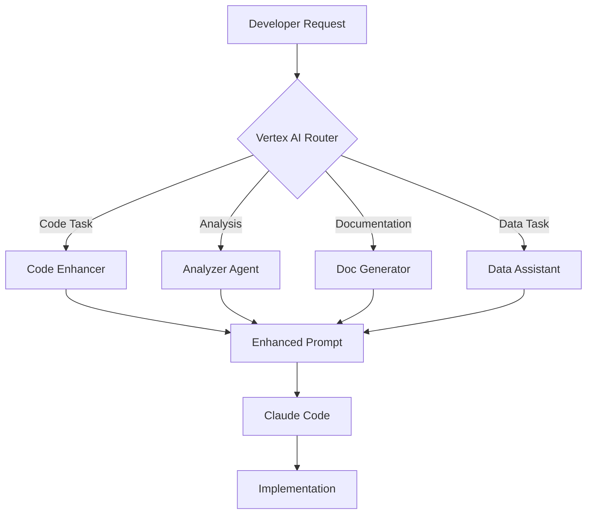

# Vertex AI Overview for FibreFlow Development

## 🧠 What is Vertex AI?

Vertex AI is Google Cloud's unified machine learning platform that provides access to powerful language models like Gemini. Think of it as Google's answer to OpenAI's GPT models, but with some key advantages:

### Key Capabilities:
- **Gemini Models**: Access to Google's most advanced LLMs
  - Gemini 1.5 Pro: 1 million token context window (vs Claude's ~200K)
  - Gemini 1.5 Flash: Faster, cheaper for quick tasks
- **Multimodal Understanding**: Can process text, images, code, and documents
- **Google Integration**: Native integration with Google Cloud services
- **Enterprise Features**: Security, compliance, and scalability

## 🎯 Why Vertex AI for FibreFlow?

### The Context Problem
When working with Claude Code, you face limitations:
- **Limited Context**: Claude can only see ~200K tokens at once
- **No Memory**: Each conversation starts fresh
- **Pattern Blindness**: Can't see the full codebase patterns
- **Hallucination Risk**: May invent APIs or patterns

### The Vertex AI Solution
Vertex AI acts as your "context preprocessor":
```
Your Request → Vertex AI (sees everything) → Enhanced Prompt → Claude Code
```

## 🔧 How Vertex AI Works

### 1. **Foundation Models**
Vertex AI provides pre-trained models you can use immediately:
- **Gemini 1.5 Pro**: Best for complex reasoning
- **Gemini 1.5 Flash**: Best for quick responses
- **Text Bison**: Legacy model, still useful
- **Code Bison**: Specialized for code generation

### 2. **API Access**
```python
from vertexai.generative_models import GenerativeModel

# Initialize model
model = GenerativeModel('gemini-1.5-pro')

# Generate content
response = model.generate_content(
    "Analyze this Angular codebase and find patterns",
    generation_config={
        "temperature": 0.2,  # Low for consistency
        "max_output_tokens": 8192,
    }
)
```

### 3. **Context Windows**
- **Gemini 1.5 Pro**: 1,048,576 tokens (~2.5 million words)
- **Gemini 1.5 Flash**: 1,048,576 tokens (same, but faster)
- **Text Bison**: 8,192 tokens (older, limited)

## 💰 Pricing Structure

### Gemini 1.5 Pro (Best for Development)
- **Input**: $3.50 per 1M tokens (up to 128K)
- **Input**: $7.00 per 1M tokens (128K+)
- **Output**: $10.50 per 1M tokens (up to 128K)
- **Output**: $21.00 per 1M tokens (128K+)

### Gemini 1.5 Flash (Best for Quick Tasks)
- **Input**: $0.075 per 1M tokens (up to 128K)
- **Input**: $0.15 per 1M tokens (128K+)
- **Output**: $0.30 per 1M tokens (up to 128K)
- **Output**: $0.60 per 1M tokens (128K+)

### Cost Example for FibreFlow
```
Daily Usage (Cached):
- 30 prompts enhanced
- 500K tokens average input (cached: 90%)
- 2K tokens output
- Cost: ~$0.50-$1.00/day
```

## 🚀 Current vs Potential Use

### What We've Built (Current)
```
vertex/
├── agents/
│   ├── codebase_scanner.py    # Indexes FibreFlow
│   ├── prompt_enhancer.py     # Enhances prompts
│   └── pattern_analyzer.py    # Finds patterns
├── cli/
│   └── vertex_cli.py          # Command interface
└── cache/
    └── codebase_index.json    # Indexed code
```

### What We Could Build (Potential)
1. **Autonomous Code Reviewer**
2. **Architecture Decision Assistant**
3. **Performance Analyzer**
4. **Security Auditor**
5. **Documentation Generator**
6. **Test Case Creator**
7. **Data Migration Assistant**

## 🎭 Agent-Based Approach

### Option 1: General Purpose Assistant (Current)
```python
# Simple, direct API calls
model = GenerativeModel('gemini-1.5-pro')
response = model.generate_content(prompt)
```

### Option 2: Specialized Agent (Recommended)
```python
# Create a FibreFlow-specific agent with system prompt
FIBREFLOW_AGENT_PROMPT = """
You are the FibreFlow Development Assistant, an expert in:
- Angular 20 with standalone components
- Firebase/Firestore integration
- TypeScript strict mode
- Material Design theming

Your role:
1. Analyze development requests
2. Find relevant patterns in the codebase
3. Generate enhanced prompts for Claude Code
4. Prevent hallucinations and bad patterns

Always enforce:
- BaseFirestoreService pattern
- Signals over BehaviorSubject
- Theme functions (ff-rgb)
- Simple, direct solutions
"""

class FibreFlowAgent:
    def __init__(self):
        self.model = GenerativeModel('gemini-1.5-pro')
        self.system_prompt = FIBREFLOW_AGENT_PROMPT
```

## 📊 Value-Add Scenarios

### 1. **Code Analysis & Pattern Detection**
```bash
vertex analyze "Find all places where we're not using signals"
# Vertex scans entire codebase, finds violations
```

### 2. **Architecture Decisions**
```bash
vertex decide "Should we use server-side pagination or client-side?"
# Vertex analyzes your data patterns, suggests best approach
```

### 3. **Performance Optimization**
```bash
vertex optimize "The pole tracker list is slow"
# Vertex analyzes component, finds bottlenecks, suggests fixes
```

### 4. **Security Audit**
```bash
vertex audit "Check for exposed API keys or security issues"
# Vertex scans for vulnerabilities, suggests fixes
```

### 5. **Data Migration Planning**
```bash
vertex migrate "Plan migration from Firestore to PostgreSQL"
# Vertex creates comprehensive migration strategy
```

### 6. **Documentation Generation**
```bash
vertex document "Create API docs for all services"
# Vertex generates complete documentation
```

## 🔄 Development Workflow Integration

### Enhanced Workflow


### Practical Examples

#### Example 1: Complex Feature Request
```bash
# Your request
vertex enhance "Add real-time collaboration to BOQ editing"

# Vertex analyzes:
- Current BOQ structure
- Firebase real-time capabilities
- Conflict resolution patterns
- Similar features in codebase

# Produces enhanced prompt with:
- Specific Firestore listeners to use
- Conflict resolution strategy
- UI update patterns
- Performance considerations
```

#### Example 2: Debugging Assistant
```bash
# Your request
vertex debug "Users report data loss in daily KPIs"

# Vertex analyzes:
- Daily KPI service code
- Firebase offline persistence
- Recent commits
- Error patterns

# Identifies:
- waitForPendingWrites not used
- Race condition in save logic
- Missing error handling
```

## 🛠️ Optimal Setup Recommendations

### 1. **Create Specialized Agents**
```python
# agents/fibreflow_agent.py
class FibreFlowAgent:
    def __init__(self):
        self.agents = {
            'code': CodeAssistant(),
            'data': DataAnalyst(),
            'security': SecurityAuditor(),
            'performance': PerformanceOptimizer(),
            'docs': DocumentationGenerator()
        }
```

### 2. **Implement Context Caching**
```python
# Cache frequently used context
class ContextCache:
    def __init__(self):
        self.pattern_cache = {}
        self.decision_cache = {}
        self.analysis_cache = {}
```

### 3. **Add Learning Loop**
```python
# Learn from corrections
class LearningAgent:
    def feedback(self, prompt, result, correction):
        # Store what worked/didn't work
        # Improve future suggestions
```

## 🎯 Quick Start Guide

### 1. Basic Enhancement (What we have)
```bash
cd vertex
python cli/vertex_cli.py enhance "Your request"
```

### 2. Advanced Agent Setup (Next step)
```bash
# Create agent configuration
cat > config/agents.yaml << EOF
agents:
  code_assistant:
    model: gemini-1.5-pro
    temperature: 0.2
    role: "FibreFlow code expert"
    
  data_analyst:
    model: gemini-1.5-flash
    temperature: 0.1
    role: "OneMap data specialist"
EOF

# Initialize agents
vertex init-agents
```

### 3. Workflow Integration
```bash
# Add to your shell
alias ai="python ~/VF/Apps/FibreFlow/vertex/cli/vertex_cli.py"

# Use throughout development
ai enhance "request"
ai analyze "code"
ai optimize "performance"
```

## 📈 ROI Calculation

### Time Savings
- **Context Gathering**: Save 10-15 min per complex request
- **Pattern Detection**: Save 20-30 min finding examples
- **Error Prevention**: Save 1-2 hours debugging
- **Documentation**: Save 2-3 hours writing docs

### Monthly Value
```
20 working days × 3 complex tasks × 30 min saved = 30 hours
30 hours × $100/hour = $3,000 value
Cost: ~$20-40/month
ROI: 75-150x
```

## 🚦 Next Steps

1. **Enable Billing**: Required for API access
2. **Create Agent System**: Specialized assistants
3. **Build Workflow Tools**: Integration scripts
4. **Add Learning Loop**: Continuous improvement
5. **Team Sharing**: Share context across team

---

*The key insight: Vertex AI isn't just another LLM - it's your codebase's "second brain" that never forgets patterns, decisions, or context.*