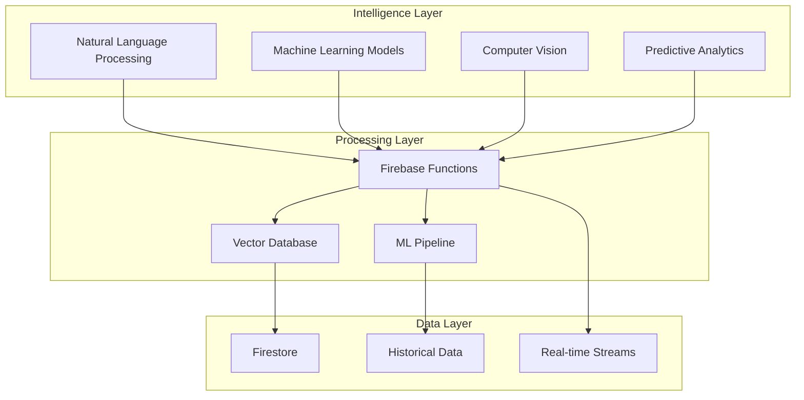

# FibreFlow AI Strategy

## Vision: Intelligence at Every Level

Transform FibreFlow from a data capture platform into an intelligent system that predicts, optimizes, and automates fiber deployment operations.

## Core AI Principles

### 1. 🎯 Purpose-Driven AI
- Every AI feature must solve a real business problem
- No AI for AI's sake
- Measurable impact on KPIs
- User value over technical complexity

### 2. 🧠 Augment, Don't Replace
- AI enhances human decision-making
- Keeps humans in the loop
- Explains recommendations
- Builds trust through transparency

### 3. 📊 Data-First Approach
- Quality data enables quality AI
- Start with what we have
- Improve data capture incrementally
- Learn from every interaction

## AI Implementation Phases

### Phase 1: Foundation (Current)
**Status**: ✅ In Progress

#### 1.1 Meeting Intelligence
- **Implemented**: Fireflies integration
- **Capability**: Automatic transcription and action items
- **Business Value**: 
  - No missed action items
  - Meeting accountability
  - Knowledge preservation

#### 1.2 Semantic Search
- **Status**: 🎯 Next Priority
- **Capability**: Natural language search across all data
- **Implementation**:
  ```mermaid
  graph LR
    A[User Query] --> B[Semantic Processing]
    B --> C[Vector Search]
    C --> D[Relevant Results]
    D --> E[Ranked by Context]
  ```
- **Business Value**:
  - Find information instantly
  - No need for exact keywords
  - Cross-module discovery

### Phase 2: Predictive Analytics (3-6 months)

#### 2.1 Delay Prediction
- **Capability**: Predict project delays before they happen
- **Data Sources**:
  - Historical project timelines
  - Daily progress patterns
  - Weather data
  - Resource availability
- **Output**: Risk scores and mitigation suggestions

#### 2.2 Cost Optimization
- **Capability**: Identify cost-saving opportunities
- **Analysis Points**:
  - Material usage patterns
  - Contractor efficiency
  - Route optimization
  - Bulk purchase timing
- **Output**: Actionable cost reduction recommendations

#### 2.3 Resource Allocation
- **Capability**: Optimize team and material distribution
- **Factors**:
  - Skill matching
  - Location proximity
  - Workload balancing
  - Equipment availability
- **Output**: Daily optimal assignments

### Phase 3: Intelligent Automation (6-12 months)

#### 3.1 Smart Scheduling
- **Capability**: Auto-generate optimal project schedules
- **Considers**:
  - Dependencies
  - Resource constraints
  - Historical performance
  - External factors
- **Output**: Self-adjusting project timelines

#### 3.2 Quality Assurance AI
- **Capability**: Detect quality issues from photos
- **Technology**: Computer vision
- **Identifies**:
  - Installation defects
  - Safety violations
  - Completion verification
- **Output**: Real-time quality alerts

#### 3.3 Automated Reporting
- **Capability**: Generate insights without prompting
- **Types**:
  - Daily summaries
  - Anomaly detection
  - Trend analysis
  - Executive dashboards
- **Output**: Proactive notifications

### Phase 4: Advanced Intelligence (12+ months)

#### 4.1 Digital Twin
- **Capability**: Virtual model of entire network
- **Features**:
  - What-if scenarios
  - Optimization simulations
  - Predictive maintenance
  - Capacity planning

#### 4.2 Autonomous Operations
- **Capability**: Self-managing workflows
- **Examples**:
  - Auto-dispatch teams
  - Dynamic rerouting
  - Preventive actions
  - Self-healing processes

## Technical Architecture

### AI Stack


### Implementation Approach

1. **Embedded AI**: Intelligence within existing features
2. **API-First**: Modular AI services
3. **Progressive Enhancement**: AI features degrade gracefully
4. **Privacy-Preserving**: On-device where possible

## Current AI Opportunities

### 1. Quick Wins (Immediate)
- **Semantic Search**: Search projects by description
- **Smart Filters**: AI-powered data filtering
- **Trend Detection**: Automatic pattern identification
- **Anomaly Alerts**: Unusual activity detection

### 2. High-Impact Features (3 months)
- **Chatbot Assistant**: Natural language interface
- **Document Intelligence**: Extract data from PDFs/images
- **Predictive Maintenance**: Equipment failure prediction
- **Route Optimization**: AI-powered path planning

### 3. Transformative Capabilities (6+ months)
- **Voice Commands**: Hands-free field operation
- **AR Assistance**: Visual installation guides
- **Automated Compliance**: Regulatory checking
- **Market Intelligence**: Competitive analysis

## Success Metrics for AI

### User Adoption
- 📈 **Target**: 80% of users engaging with AI features
- 📊 **Measure**: Feature usage analytics
- 🎯 **Key Indicator**: Repeat usage patterns

### Time Savings
- 📈 **Target**: 30% reduction in administrative tasks
- 📊 **Measure**: Task completion times
- 🎯 **Key Indicator**: Automation rate

### Decision Quality
- 📈 **Target**: 25% improvement in project outcomes
- 📊 **Measure**: Success rates, cost variance
- 🎯 **Key Indicator**: AI recommendation acceptance

### ROI
- 📈 **Target**: 5x return on AI investment
- 📊 **Measure**: Cost savings + efficiency gains
- 🎯 **Key Indicator**: Business impact metrics

## AI Governance

### Ethical Guidelines
1. **Transparency**: Users understand AI decisions
2. **Fairness**: No bias in recommendations
3. **Privacy**: Data used responsibly
4. **Control**: Users can override AI

### Quality Assurance
1. **Continuous Monitoring**: Track AI performance
2. **Human Validation**: Regular accuracy checks
3. **Feedback Loops**: Learn from corrections
4. **A/B Testing**: Validate improvements

## Integration with Existing Features

### Meeting Intelligence → Project Insights
```
Fireflies Transcripts → Action Items → Project Updates → Trend Analysis
```

### Daily Progress → Predictive Analytics
```
Field Data → Pattern Recognition → Delay Prediction → Proactive Alerts
```

### Stock Management → Optimization
```
Inventory Levels → Usage Patterns → Demand Forecast → Auto-Ordering
```

## Next Steps

1. **Implement Semantic Search** (Priority 1)
2. **Build Analytics Dashboard** (Priority 2)
3. **Deploy First ML Model** (Priority 3)
4. **Gather User Feedback** (Continuous)

## Related Documentation

- [[System Overview]] - Technical architecture
- [[Current State]] - What's built
- [[Roadmap]] - Implementation timeline
- [[Development Philosophy]] - How we build

## Key Takeaway

AI in FibreFlow isn't about replacing human intelligence—it's about amplifying it. Every AI feature should make users feel smarter, faster, and more confident in their decisions. The goal is to handle the routine so humans can focus on the exceptional.