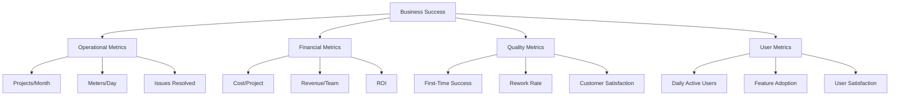

# FibreFlow Project Goals

## Mission Statement

To revolutionize fiber optic infrastructure deployment by providing a unified, intelligent platform that connects office planning with field execution, enabling faster, more efficient, and data-driven network rollouts.

## Primary Business Objectives

### 1. 🚀 Accelerate Deployment Speed
**Target**: Reduce project completion time by 30%
- **Current State**: Manual coordination, paper-based tracking
- **Future State**: Real-time digital coordination
- **Key Metrics**:
  - Average project duration
  - Daily installation rate
  - Time from planning to activation

### 2. 💰 Improve Cost Control
**Target**: Achieve 95% budget accuracy
- **Current State**: Reactive cost discovery, delayed reporting
- **Future State**: Proactive cost monitoring with alerts
- **Key Metrics**:
  - Budget variance percentage
  - Cost per meter installed
  - Payment cycle time

### 3. 📊 Enable Data-Driven Decisions
**Target**: 90% decisions backed by system data
- **Current State**: Gut-feel and experience-based
- **Future State**: AI-powered insights and predictions
- **Key Metrics**:
  - Data capture rate
  - Report utilization
  - Prediction accuracy

### 4. 🤝 Enhance Team Coordination
**Target**: 50% reduction in coordination overhead
- **Current State**: Phone calls, WhatsApp, emails
- **Future State**: Unified platform with real-time updates
- **Key Metrics**:
  - Communication time saved
  - Issue resolution speed
  - Team satisfaction score

## Strategic Goals

### Short Term (3-6 months)
1. ✅ **Core Platform Stability**
   - All basic CRUD operations working
   - Mobile-friendly interface
   - Reliable data synchronization

2. 🎯 **User Adoption**
   - 80% of teams actively using system
   - Daily progress capture habit formed
   - Positive user feedback

3. 📈 **Initial Intelligence**
   - Basic reporting functional
   - Meeting insights captured
   - Trend identification

### Medium Term (6-12 months)
1. 🤖 **AI Integration**
   - Predictive analytics for delays
   - Automated resource optimization
   - Smart alerts and notifications

2. 🌍 **Geographic Intelligence**
   - Full OneMap integration
   - Route optimization
   - Area coverage analytics

3. 💼 **Business Intelligence**
   - Executive dashboards
   - ROI calculations
   - Competitive benchmarking

### Long Term (12+ months)
1. 🚁 **Autonomous Operations**
   - Self-optimizing schedules
   - Predictive maintenance
   - Automated compliance

2. 🌐 **Ecosystem Platform**
   - Third-party integrations
   - API marketplace
   - Industry standard

3. 🎓 **Knowledge Platform**
   - Best practices repository
   - Training modules
   - Performance coaching

## Success Metrics Framework

## Value Propositions

### For Field Teams
- 📱 Easy mobile data entry
- 🗺️ Clear work assignments
- 💵 Transparent payment tracking
- 📸 Simple photo documentation

### For Project Managers
- 👁️ Real-time project visibility
- 📊 Automated reporting
- 🚨 Early warning system
- 📈 Performance analytics

### For Executives
- 💡 Strategic insights
- 💰 Financial control
- 🎯 Goal tracking
- 🔮 Predictive planning

### For Contractors
- 📋 Clear scope definition
- 💸 Fast payment processing
- 📊 Performance feedback
- 🤝 Fair work distribution

## Competitive Advantages

1. **Fiber-Specific**: Built specifically for fiber deployment, not generic construction
2. **Mobile-First**: Designed for field use, not just office
3. **AI-Powered**: Intelligence built-in, not bolted-on
4. **Real-Time**: Live updates, not batch processing
5. **Integrated**: Single platform, not multiple tools

## Risk Mitigation

### Technology Risks
- **Mitigation**: Simple architecture, proven stack
- **Monitoring**: Performance metrics, error tracking

### Adoption Risks
- **Mitigation**: User-centric design, training program
- **Monitoring**: Usage analytics, feedback loops

### Data Risks
- **Mitigation**: Security-first, audit trails
- **Monitoring**: Access logs, compliance checks

## Alignment with Company Vision

FibreFlow directly supports VelocityFibre's mission to:
- Build world-class fiber infrastructure
- Deliver exceptional customer experiences
- Operate with maximum efficiency
- Lead through innovation

## Next Steps

1. Review [[Current State]] to see progress
2. Check [[Roadmap]] for timeline
3. Explore [[AI Strategy]] for intelligence features
4. Read [[Use Cases]] for real scenarios

## Measuring Success

Success is not just features delivered, but business impact achieved:
- Faster deployments = More customers connected
- Better data = Smarter decisions
- Happier teams = Better quality work
- Lower costs = Sustainable growth

> "What gets measured gets managed" - Peter Drucker

The goal is not just to build software, but to transform how fiber networks are deployed.