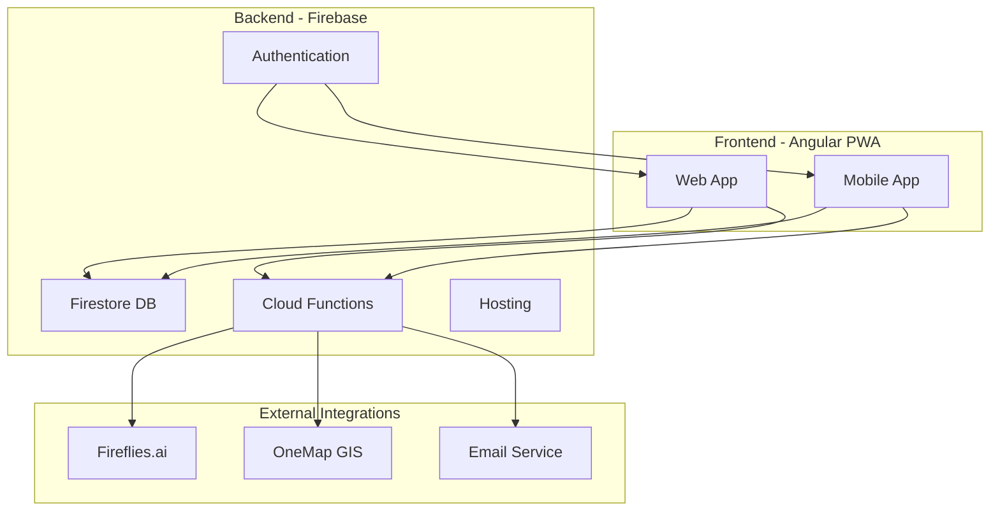
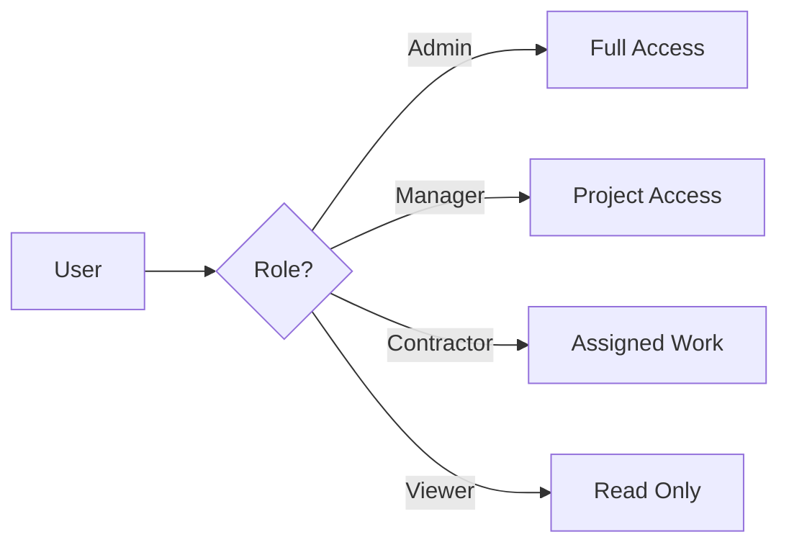

# FibreFlow System Overview

## What is FibreFlow?

FibreFlow is a comprehensive **Fiber Optic Infrastructure Management System** designed to streamline the entire lifecycle of fiber optic network deployment - from planning through execution to maintenance.

## Core Purpose

Enable fiber optic deployment teams to:
- 📍 Track infrastructure installation progress in real-time
- 💰 Manage project costs and contractor payments
- 📊 Generate insights from field data
- 🤝 Coordinate between office and field teams
- 📈 Measure and improve deployment efficiency

## High-Level Architecture

## Key Modules

### 1. Project Management
- **Purpose**: Central hub for all fiber deployment projects
- **Features**: 
  - Project lifecycle tracking
  - Multi-phase management
  - Resource allocation
  - Progress monitoring

### 2. Daily Progress Tracking
- **Purpose**: Capture field work as it happens
- **Features**:
  - Daily KPI entry
  - Photo documentation
  - Quality metrics
  - Financial tracking

### 3. BOQ & Costing
- **Purpose**: Manage Bill of Quantities and project finances
- **Features**:
  - Material tracking
  - Cost estimation
  - Quote generation
  - Budget vs actual analysis

### 4. Contractor Management
- **Purpose**: Coordinate with installation teams
- **Features**:
  - Contractor assignments
  - Payment tracking
  - Performance metrics
  - Work validation

### 5. Meeting Intelligence
- **Purpose**: Transform meetings into actionable insights
- **Features**:
  - Automatic transcription via [[Fireflies Integration]]
  - Action item extraction
  - Decision tracking
  - Follow-up management

### 6. Inventory & Stock
- **Purpose**: Track materials and equipment
- **Features**:
  - Real-time stock levels
  - Movement tracking
  - Allocation management
  - Reorder alerts

## Technology Stack

### Frontend
- **Framework**: Angular 20 with Signals
- **UI Library**: Angular Material
- **Styling**: SCSS with CSS Variables
- **State**: RxJS + Signals
- **PWA**: Offline-capable

### Backend
- **Database**: Firebase Firestore
- **Functions**: Node.js serverless
- **Auth**: Firebase Authentication
- **Storage**: Firebase Storage
- **Hosting**: Firebase Hosting

### Development
- **Version Control**: Jujutsu (jj) with Git
- **CI/CD**: Direct deployment via Firebase
- **Quality**: antiHall validation system
- **Documentation**: Markdown + Obsidian

## Design Principles

1. **Simplicity First**: Basic CRUD before complex features
2. **Mobile-Ready**: Field teams work on phones
3. **Offline-Capable**: Work without connectivity
4. **Real-Time Sync**: Changes visible immediately
5. **Role-Based**: Different views for different users

## Security Model

## Data Architecture

All data follows a consistent pattern:
- Documents in Firestore collections
- Real-time synchronization
- Audit trail for changes
- Soft deletes (isActive flag)
- Timestamps on everything

## Success Metrics

- 🚀 **Deployment Speed**: Reduce project timeline by 30%
- 💰 **Cost Control**: Track expenses within 5% accuracy
- 📊 **Data Quality**: 90%+ field data capture rate
- 🎯 **User Adoption**: Active daily use by 80% of teams

## Related Documentation

- [[Project Goals]] - Business objectives
- [[Current State]] - What's implemented
- [[Data Flow]] - How information moves
- [[AI Strategy]] - Intelligence layer
- [[Development Philosophy]] - How we build

## Technical Deep Dive

For implementation details, see:
- [Technical Documentation](../../docs/)
- [API Reference](../../docs/API_REFERENCE.md)
- [Component Library](../../docs/COMPONENT_LIBRARY.md)