# FibreFlow Current State

*Last Updated: January 2025*

## Production-Ready Features ✅

### 1. Projects Module
**Status**: ✅ Fully Implemented
**What it does**: Central hub for managing fiber deployment projects
**Key Features**:
- Complete CRUD operations
- Multi-phase project structure
- Integration with BOQ, contractors, tasks
- Real-time status tracking
- Project templates

**Business Value**:
- Single source of truth for all projects
- Clear visibility into project status
- Reduced coordination overhead

### 2. Daily Progress Tracking
**Status**: ✅ Fully Implemented
**What it does**: Captures field work data as it happens
**Key Features**:
- Mobile-optimized forms
- Daily KPI entry
- Financial tracking
- Quality metrics
- Weekly report generation
- Photo upload capability

**Business Value**:
- Real-time progress visibility
- Accurate cost tracking
- Quality assurance data
- Automated reporting

### 3. Staff Management
**Status**: ✅ Fully Implemented
**What it does**: Manage team members and access control
**Key Features**:
- Role-based access control
- Staff profiles and contact info
- Import from Excel
- Activity tracking
- Permission management

**Business Value**:
- Secure access control
- Clear team structure
- Efficient onboarding

### 4. Meeting Intelligence
**Status**: ✅ Fully Implemented
**What it does**: Transform meetings into actionable insights
**Key Features**:
- Fireflies.ai integration
- Automatic transcript sync
- Action item extraction
- Meeting search
- Decision tracking

**Business Value**:
- No lost action items
- Meeting accountability
- Knowledge preservation
- Time savings

### 5. Stock/Inventory Management
**Status**: ✅ Fully Implemented
**What it does**: Track materials and equipment
**Key Features**:
- Real-time stock levels
- Movement tracking
- Location management
- Import/export capability
- Low stock alerts

**Business Value**:
- Prevent stockouts
- Reduce waste
- Optimize inventory costs
- Better planning

### 6. BOQ (Bill of Quantities)
**Status**: ✅ Fully Implemented
**What it does**: Manage project materials and costs
**Key Features**:
- Excel import/export
- Template management
- Quote generation
- Cost tracking
- Allocation management

**Business Value**:
- Accurate costing
- Faster quotes
- Better margins
- Reduced errors

### 7. Contractor Management
**Status**: ✅ Fully Implemented
**What it does**: Coordinate with installation teams
**Key Features**:
- Contractor profiles
- Work assignment
- Payment tracking
- Performance metrics
- Document management

**Business Value**:
- Fair work distribution
- Payment transparency
- Performance improvement
- Better relationships

### 8. Pole Tracker
**Status**: ✅ Fully Implemented
**What it does**: Track pole installations with maps
**Key Features**:
- Google Maps integration
- Mobile/desktop views
- Offline capability
- Status tracking
- Route optimization

**Business Value**:
- Visual progress tracking
- Efficient routing
- Field coordination
- Coverage analysis

### 9. Development Panel (New!)
**Status**: ✅ Just Completed
**What it does**: Admin-only panel for dev notes and tasks
**Key Features**:
- Route-specific notes
- Task management per page
- Priority tracking
- Admin-only visibility
- Real-time sync

**Business Value**:
- Better development tracking
- Context-aware notes
- Improved maintenance

## Partially Implemented Features 🔄

### 1. Reports Module
**Status**: 🔄 Basic Structure Ready
**What's Done**:
- Report listing page
- Basic UI structure
- PDF generation capability

**What's Missing**:
- Report templates
- Automated generation
- Custom report builder
- Scheduled reports

### 2. Suppliers
**Status**: 🔄 Basic CRUD
**What's Done**:
- Supplier profiles
- Contact information
- Basic management

**What's Missing**:
- Purchase orders
- Performance tracking
- Integration with stock
- Payment terms

### 3. Quotes/RFQ
**Status**: 🔄 In Progress
**What's Done**:
- Quote creation
- Basic templates
- PDF export

**What's Missing**:
- Email integration
- Approval workflow
- Version tracking
- Comparison tools

### 4. Tasks
**Status**: 🔄 Basic Implementation
**What's Done**:
- Task creation
- Assignment
- Status tracking

**What's Missing**:
- Notifications
- Dependencies
- Gantt charts
- Automation

## Technical Implementation Status

### Frontend Architecture
- ✅ Angular 20 with Signals
- ✅ Standalone components
- ✅ Material Design
- ✅ Theme system (4 themes)
- ✅ Responsive design
- ✅ PWA capabilities

### Backend Architecture
- ✅ Firebase Firestore
- ✅ Cloud Functions
- ✅ Authentication
- ✅ Real-time sync
- ✅ Audit trails
- ✅ Security rules

### Development Infrastructure
- ✅ Jujutsu version control
- ✅ Direct deployment pipeline
- ✅ antiHall validation
- ✅ Context engineering
- ✅ Comprehensive documentation

### Integrations
- ✅ Fireflies.ai (meetings)
- 🔄 OneMap (partial)
- 🔄 Email (basic)
- ❌ SMS notifications
- ❌ WhatsApp integration

## System Health Metrics

```mermaid
graph LR
    A[System Health] --> B[Performance: ✅]
    A --> C[Reliability: ✅]
    A --> D[Security: ✅]
    A --> E[Scalability: ✅]
    
    B --> B1[Page Load < 3s]
    B --> B2[API Response < 500ms]
    
    C --> C1[99.9% Uptime]
    C --> C2[Zero Data Loss]
    
    D --> D1[Role-Based Access]
    D --> D2[Audit Trails]
    
    E --> E1[Handles Current Load]
    E --> E2[Room for 10x Growth]
```

## Active User Features

### What Users Love
1. **Mobile Experience**: Field teams can enter data on phones
2. **Real-time Sync**: Changes visible immediately
3. **Simple Interface**: Easy to learn and use
4. **Offline Mode**: Works without internet
5. **Quick Deploy**: Fast updates and fixes

### Common User Requests
1. **Push Notifications**: Alert on important events
2. **Bulk Operations**: Multi-select actions
3. **Advanced Filters**: More search options
4. **Data Export**: More export formats
5. **Dashboard Customization**: Personalized views

## Development Velocity

### Recent Achievements
- ✅ Completed core modules ahead of schedule
- ✅ Stable production deployment
- ✅ High user adoption rate
- ✅ Minimal bug reports
- ✅ Fast feature delivery

### Current Focus
- 🎯 AI intelligence features
- 🎯 Advanced analytics
- 🎯 Integration expansion
- 🎯 Performance optimization
- 🎯 User experience refinements

## Known Limitations

### Technical Debt
- Material theme needs custom colors
- Some components need optimization
- Test coverage could be higher
- Documentation needs updates

### Feature Gaps
- No automated workflows yet
- Limited reporting options
- Basic notification system
- No API for external access
- Limited offline capabilities

## Next Steps

1. Review [[AI Strategy]] for intelligence features
2. Check [[Roadmap]] for upcoming features
3. See [[Integration Points]] for expansion
4. Read [[Use Cases]] for user scenarios

## Overall Assessment

**System Status**: 🟢 Production Ready

FibreFlow has achieved its initial goal of providing a functional, reliable platform for fiber deployment management. The core features are stable, users are adopting the system, and the foundation is solid for future enhancements.

**Key Strengths**:
- Simple, working solution
- High user satisfaction
- Reliable performance
- Rapid development
- Strong foundation

**Areas for Growth**:
- Intelligence features
- Advanced analytics
- Workflow automation
- Third-party integrations
- Mobile enhancements

The platform is ready for the next phase: adding intelligence and automation to transform from a data capture tool into a strategic advantage.