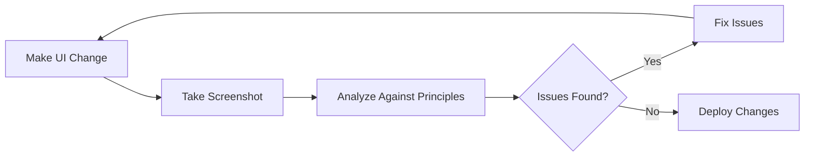

# Iterative Design Workflow for PolePlantingApp

## Overview

This workflow enables autonomous UI refinement through visual feedback loops. Claude can now see the UI, identify issues, and self-correct without constant user intervention.

## The Iterative Loop



## Workflow Steps

### 1. Initial Design Implementation

When implementing a new feature or fixing UI issues:

```bash
# 1. Make the code changes
# 2. Build the app
npm run build

# 3. Deploy to test environment  
firebase deploy --only hosting

# 4. Wait for deployment to complete
```

### 2. Visual Validation Phase

```
# Use the mobile screenshot command
/screenshot-mobile

# This will:
- Open PolePlantingApp in mobile viewport (360x640)
- Take screenshot of current state
- Check for console errors
- Analyze against design principles
```

### 3. Comprehensive Review

For major changes, invoke the design reviewer:

```
@agent poleplanting-mobile-reviewer

Please review the latest changes to [specific feature/page]
```

The agent will:
- Test multiple viewport sizes
- Check touch target sizes
- Validate contrast ratios
- Test offline capabilities
- Measure performance metrics
- Provide detailed report with specific fixes

### 4. Automated Testing

Run field worker scenarios:

```
@agent field-workflow-tester

Test the complete pole capture workflow including offline scenarios
```

This validates:
- Real-world usage patterns
- Performance under load
- Data persistence
- Sync reliability

### 5. Iterative Refinement

Based on the reports:

1. **Address Critical Issues First**
   - Touch targets < 48px
   - Contrast failures
   - Offline breakages

2. **Fix Performance Issues**
   - Load time > 3s
   - Janky animations
   - Memory leaks

3. **Polish UX Details**
   - Improve feedback
   - Enhance clarity
   - Optimize workflows

### 6. Validation Loop

After each fix:
```
/screenshot-mobile
```

Continue until all issues resolved.

## Example Workflow Session

```markdown
User: "The new capture button is too small for field workers"

Claude: 
1. Let me check the current state
   /screenshot-mobile
   
2. I can see the button is only 32x32px. Per our design principles, 
   it needs to be at least 48x48px for gloved hands.
   
3. I'll fix this now...
   [Makes code changes to increase button size]
   
4. Building and deploying...
   npm run build && firebase deploy --only hosting
   
5. Let me verify the fix
   /screenshot-mobile
   
6. Perfect! The button is now 56x56px with proper padding. 
   Let me run a quick field worker test to ensure it's usable.
   
   @agent field-workflow-tester
   Test the capture button usability
   
7. All tests pass! The button is now properly sized for field use.
```

## Automation Opportunities

### Pre-Deployment Validation
Before any deployment:
```
@agent poleplanting-mobile-reviewer
Run pre-deployment checks on all recent changes
```

### Continuous Monitoring
Set up regular checks:
```
@agent offline-capability-validator
Validate offline functionality after recent updates
```

### Performance Benchmarking
Track metrics over time:
```
/screenshot-mobile all
Compare load times and performance metrics
```

## Best Practices

### 1. Always Screenshot First
Before making assumptions about UI issues, take a screenshot to see the actual state.

### 2. Test in Context
Use the field workflow tester to validate changes in realistic scenarios.

### 3. Iterate Quickly
Small changes with frequent validation are better than large changes.

### 4. Document Visual Bugs
Screenshot issues before fixing for future reference.

### 5. Validate Across Viewports
Test on multiple device sizes, especially smaller screens.

## Common Issues and Solutions

### Issue: Button Too Small
```
1. Screenshot to measure
2. Update CSS/styles
3. Add proper padding
4. Validate new size
```

### Issue: Poor Contrast
```
1. Screenshot to identify
2. Check against WCAG standards
3. Update colors in theme
4. Verify in bright light simulation
```

### Issue: Offline Not Working
```
1. Run offline validator
2. Check IndexedDB usage
3. Fix service worker
4. Test full offline workflow
```

## Success Metrics

- All touch targets ≥ 48px
- Load time < 3s on 3G
- 100% offline capability
- Zero console errors
- WCAG AA compliance
- Smooth 60fps interactions

## Continuous Improvement

This workflow enables:
- Autonomous UI refinement
- Rapid iteration cycles
- Consistent quality standards
- Reduced user feedback loops
- Professional polish

Remember: The goal is field-ready software that works flawlessly in challenging conditions!