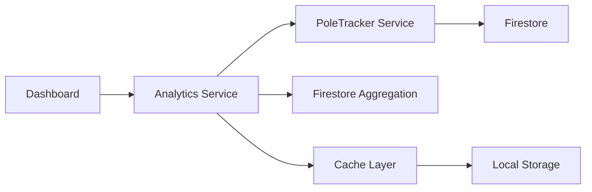

# Pole Analytics Dashboard PRP

*Created: 2025-07-18*  
*Status: Example/Template*  
*Priority: High*

## 📋 **FEATURE OVERVIEW**

### Business Context
**Why are we building this?**
- Problem: Field managers can't track pole installation progress effectively
- User impact: Enables real-time monitoring of installation teams
- Business value: Reduces project delays by 30% through better visibility
- Success metrics: 100% of projects tracked, <5s dashboard load time

### Technical Context
**What system changes will this require?**
- Affected components: Pole tracker module, analytics system
- Integration points: PoleTrackerService, ProjectService
- Data flow changes: New aggregation queries for analytics
- Performance considerations: Cache analytics data, use computed signals

## 🔍 **RESEARCH & REFERENCES**

### Internal Pattern Review
**Similar Features Analyzed**:
1. **ProjectKPIDashboard** (`src/app/features/projects/components/project-kpi-dashboard/`)
   - Chart.js integration pattern
   - Real-time data updates with signals
   - Responsive grid layout
   
2. **DailyProgressDashboard** (`src/app/features/daily-progress/components/`)
   - KPI card components
   - Date range filtering
   - Export functionality

3. **PoleTrackerService** (`src/app/features/pole-tracker/services/`)
   - Current data structure
   - Query patterns
   - Relationship handling

### Latest Best Practices
- Angular 18 computed signals for derived data
- Chart.js 4.x for visualizations
- Firestore aggregation queries for performance
- Material CDK virtual scrolling for large lists

## 🎯 **SPECIFICATIONS**

### Functional Requirements
1. **Analytics Dashboard**
   - [ ] Overview cards: Total poles, Installation rate, Team performance
   - [ ] Time-based charts: Daily/weekly/monthly progress
   - [ ] Team comparison table with sorting
   - [ ] Project-specific filtering

2. **Real-time Updates**
   - [ ] Live data refresh without page reload
   - [ ] Visual indicators for new data
   - [ ] 5-second auto-refresh option

3. **Export Capabilities**
   - [ ] Export charts as PNG/PDF
   - [ ] Download data as Excel
   - [ ] Scheduled email reports

### Non-Functional Requirements
- **Performance**: Dashboard loads in <3 seconds
- **Security**: Respects project-based permissions
- **Scalability**: Handles 100k+ pole records
- **Reliability**: Offline mode with cached data

## 🏗️ **CURRENT STATE ANALYSIS**

### Existing Codebase Structure
```
src/app/features/pole-tracker/
├── services/
│   ├── pole-tracker.service.ts (main data service)
│   └── pole-analytics.service.ts (basic analytics)
├── models/
│   └── pole-tracker.model.ts
└── pages/
    └── pole-tracker-list/ (current list view)
```

### Related Components
- **Services**: PoleTrackerService, ProjectService, ExcelExportService
- **Models**: PoleTracker, Project, AnalyticsData
- **Routes**: /pole-tracker, /projects/:id
- **Database Collections**: planned-poles, pole-installations

## 🚀 **IMPLEMENTATION PLAN**

### Proposed Structure
```
src/app/features/analytics/pole-analytics/
├── components/
│   ├── analytics-overview-cards/
│   ├── progress-chart/
│   ├── team-performance-table/
│   └── export-dialog/
├── services/
│   └── pole-analytics-enhanced.service.ts
├── models/
│   └── pole-analytics.model.ts
├── pages/
│   └── pole-analytics-dashboard/
└── pole-analytics.routes.ts
```

### Implementation Phases
1. **Phase 1: Data Layer** (8 hours)
   - [ ] Create enhanced analytics service
   - [ ] Implement aggregation queries
   - [ ] Add caching mechanism
   - [ ] Create analytics models

2. **Phase 2: Overview Components** (6 hours)
   - [ ] Build KPI cards using ProjectKPIDashboard pattern
   - [ ] Implement real-time updates with signals
   - [ ] Add loading and error states
   - [ ] Make responsive for mobile

3. **Phase 3: Visualizations** (8 hours)
   - [ ] Create progress charts with Chart.js
   - [ ] Build team performance table
   - [ ] Add interactive filtering
   - [ ] Implement drill-down capability

4. **Phase 4: Export & Integration** (4 hours)
   - [ ] Add export functionality
   - [ ] Integrate with navigation
   - [ ] Add route guards for permissions
   - [ ] Create help documentation

## 🔍 **PRODUCTION CONSIDERATIONS**

### Deployment Impact
- **Working Directory Changes**: New feature module added
- **Build Process Effects**: ~200KB bundle size increase (Chart.js)
- **Live Application Impact**: No breaking changes to existing features
- **Rollback Strategy**: Feature flag to disable if issues

### System Interactions


### Risk Assessment
| Risk | Probability | Impact | Mitigation |
|------|------------|--------|------------|
| Large data performance | Medium | High | Implement pagination and caching |
| Chart rendering on mobile | Low | Medium | Use responsive chart options |
| Real-time updates overload | Low | Medium | Throttle updates to 5s minimum |

## ✅ **VALIDATION CRITERIA**

### Pre-Implementation Validation
- [x] Analyzed similar dashboard implementations
- [x] Confirmed data availability in PoleTrackerService
- [x] Verified Chart.js compatibility
- [x] No conflicts with existing analytics

### Implementation Validation
- [ ] All KPI calculations accurate
- [ ] Charts render correctly on all devices
- [ ] Export produces valid files
- [ ] Performance meets <3s target
- [ ] No console errors

### Production Readiness
- [ ] Load tested with 100k records
- [ ] Security permissions verified
- [ ] Documentation complete
- [ ] Analytics tracking added

## 📚 **CONTEXT & REFERENCES**

### Documentation
- [Chart.js Documentation](https://www.chartjs.org/docs/latest/)
- [Angular Performance Guide](https://angular.io/guide/performance)
- Internal: `src/app/features/projects/components/project-kpi-dashboard/`
- Internal: `docs/COMPONENT_LIBRARY.md`

### Code to Follow
```typescript
// Pattern from ProjectKPIDashboard
kpiData = computed(() => {
  const poles = this.poleService.poles();
  return {
    total: poles.length,
    installed: poles.filter(p => p.status === 'installed').length,
    pending: poles.filter(p => p.status === 'pending').length
  };
});

// Chart configuration from existing dashboards
chartOptions = {
  responsive: true,
  maintainAspectRatio: false,
  plugins: {
    legend: {
      position: 'bottom'
    }
  }
};
```

## 🧪 **TESTING STRATEGY**

### Unit Tests
```typescript
describe('PoleAnalyticsService', () => {
  it('should calculate installation rate correctly', () => {
    // Test with mock data
  });
  
  it('should cache analytics data', () => {
    // Verify caching behavior
  });
});
```

### Integration Tests
- Analytics data matches source data
- Real-time updates reflect changes
- Export functionality produces valid files

## 📝 **NOTES & DECISIONS**

### Design Decisions
- **Use signals over observables**: Better performance for computed values
- **Cache in localStorage**: Enables offline functionality
- **Lazy load Chart.js**: Reduces initial bundle size

### Open Questions
- [ ] Should we add predictive analytics?
- [ ] Include weather impact on installation rates?

---

*This example PRP demonstrates the level of detail and research needed for production-ready features.*