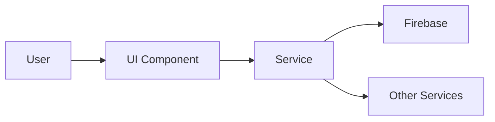

# Feature PRP Template - [FEATURE_NAME]

*Created: [DATE]*  
*Status: Planning | In Progress | Completed*  
*Priority: High | Medium | Low*

## 📋 **FEATURE OVERVIEW**

### Business Context
**Why are we building this?**
- Problem statement:
- User impact:
- Business value:
- Success metrics:

### Technical Context
**What system changes will this require?**
- Affected components:
- Integration points:
- Data flow changes:
- Performance considerations:

## 🎯 **SPECIFICATIONS**

### Functional Requirements
1. **Core Functionality**
   - [ ] Requirement 1
   - [ ] Requirement 2
   - [ ] Requirement 3

2. **User Experience**
   - [ ] UI/UX requirement 1
   - [ ] UI/UX requirement 2

3. **Edge Cases**
   - [ ] Edge case handling 1
   - [ ] Edge case handling 2

### Non-Functional Requirements
- **Performance**: [e.g., < 200ms response time]
- **Security**: [e.g., Role-based access control]
- **Scalability**: [e.g., Support 10,000 concurrent users]
- **Reliability**: [e.g., 99.9% uptime]

## 🏗️ **CURRENT STATE ANALYSIS**

### Existing Codebase Structure
```
src/app/features/[existing-feature]/
├── components/
├── services/
├── models/
└── pages/
```

### Related Components
- **Services**: 
- **Models**: 
- **Routes**: 
- **Database Collections**: 

### Dependencies
- External libraries:
- Internal services:
- API endpoints:

## 🚀 **IMPLEMENTATION PLAN**

### Proposed Structure
```
src/app/features/[new-feature]/
├── components/
│   ├── [component-name]/
│   │   ├── [component-name].component.ts
│   │   ├── [component-name].component.html
│   │   └── [component-name].component.scss
├── services/
│   └── [service-name].service.ts
├── models/
│   └── [model-name].model.ts
├── pages/
│   └── [page-name]/
└── [feature].routes.ts
```

### Implementation Phases
1. **Phase 1: Foundation** (Time estimate)
   - [ ] Create models and interfaces
   - [ ] Set up service with BaseFirestoreService
   - [ ] Create routing structure

2. **Phase 2: Core Features** (Time estimate)
   - [ ] Implement CRUD operations
   - [ ] Build list view component
   - [ ] Create form component
   - [ ] Add validation

3. **Phase 3: Integration** (Time estimate)
   - [ ] Connect to existing systems
   - [ ] Add to navigation
   - [ ] Implement permissions

4. **Phase 4: Polish** (Time estimate)
   - [ ] Error handling
   - [ ] Loading states
   - [ ] Mobile responsiveness
   - [ ] Theme compliance

## 🔍 **PRODUCTION CONSIDERATIONS**

### Deployment Impact
- **Working Directory Changes**:
- **Build Process Effects**:
- **Live Application Impact**:
- **Rollback Strategy**:

### System Interactions


### Risk Assessment
| Risk | Probability | Impact | Mitigation |
|------|------------|--------|------------|
| [Risk 1] | Low/Med/High | Low/Med/High | [Strategy] |
| [Risk 2] | Low/Med/High | Low/Med/High | [Strategy] |

## ✅ **VALIDATION CRITERIA**

### Pre-Implementation Validation
- [ ] Requirements reviewed and approved
- [ ] Technical approach validated
- [ ] No conflicts with existing features
- [ ] Production impact assessed

### Implementation Validation
- [ ] Unit tests written and passing
- [ ] Integration tests completed
- [ ] Manual testing checklist completed
- [ ] Code review passed

### Production Readiness
- [ ] Performance benchmarks met
- [ ] Security scan passed
- [ ] Documentation updated
- [ ] Deployment plan reviewed

## 📚 **CONTEXT & REFERENCES**

### Documentation
- [Angular Style Guide](https://angular.io/guide/styleguide)
- [Firebase Best Practices](https://firebase.google.com/docs/firestore/best-practices)
- Internal: `docs/COMPONENT_LIBRARY.md`
- Internal: `docs/API_REFERENCE.md`

### Similar Features
- Reference implementation: [Similar feature name]
- Pattern to follow: [Pattern name]
- Anti-patterns to avoid: [What not to do]

### External Resources
- API documentation: [Links]
- Library documentation: [Links]
- Design specifications: [Links]

## 🎨 **UI/UX SPECIFICATIONS**

### Mockups
[Attach or link to mockups]

### User Flow
1. User navigates to [feature]
2. User performs [action]
3. System responds with [result]

### Responsive Design
- **Desktop**: Full feature set
- **Tablet**: [Adjustments]
- **Mobile**: [Adjustments]

## 🧪 **TESTING STRATEGY**

### Unit Tests
```typescript
// Example test structure
describe('[FeatureName]Service', () => {
  it('should create', () => {
    // Test implementation
  });
});
```

### Integration Tests
- Test data flow between components
- Test Firebase operations
- Test error scenarios

### E2E Tests
- User journey 1: [Description]
- User journey 2: [Description]

## 📝 **NOTES & DECISIONS**

### Design Decisions
- **Decision 1**: [Rationale]
- **Decision 2**: [Rationale]

### Open Questions
- [ ] Question 1?
- [ ] Question 2?

### Future Enhancements
- Enhancement 1: [Description]
- Enhancement 2: [Description]

---

## 🚦 **APPROVAL & SIGN-OFF**

- [ ] Business Requirements Approved By: _________ Date: _____
- [ ] Technical Design Approved By: _________ Date: _____
- [ ] Security Review Completed By: _________ Date: _____
- [ ] Production Readiness Verified By: _________ Date: _____

---

*This PRP follows the FibreFlow context engineering standards. Update all sections as the feature evolves.*