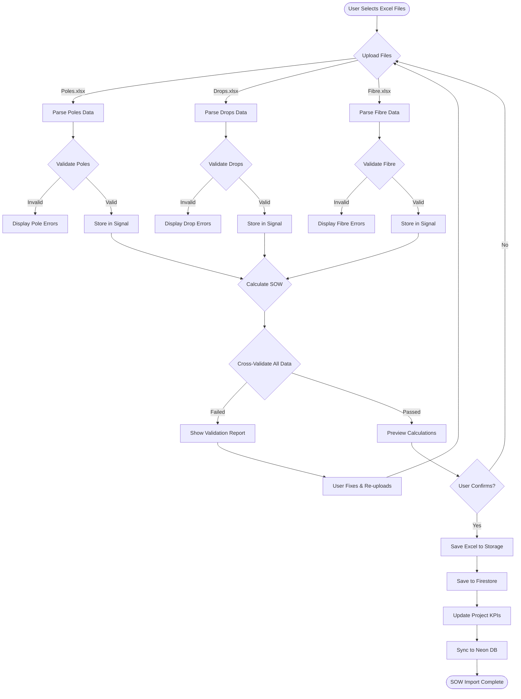

# SOW Module - Data Flow & State Management Plan

## Overview
This document details the complete data flow through the SOW module, from Excel upload to final storage in both Firebase and Neon.

## Data Flow Diagram



## State Management Flow

### 1. Component State (Signals)

```typescript
// sow-import.component.ts - State Structure
export class SowImportComponent {
  // File upload states
  polesFile = signal<File | null>(null);
  dropsFile = signal<File | null>(null);
  fibreFile = signal<File | null>(null);
  
  // Parsed data states
  polesData = signal<PoleImportData[]>([]);
  dropsData = signal<DropImportData[]>([]);
  fibreData = signal<FibreImportData[]>([]);
  
  // Processing states
  processingState = signal<ProcessingState>('idle');
  currentStep = signal<number>(0);
  
  // Validation states
  validationResults = signal<ValidationResults | null>(null);
  hasErrors = computed(() => 
    this.validationResults()?.errors.length ?? 0 > 0
  );
  
  // Calculation states
  calculations = signal<SOWCalculations | null>(null);
  
  // UI states
  isLoading = signal<boolean>(false);
  uploadProgress = signal<number>(0);
  showPreview = signal<boolean>(false);
}

type ProcessingState = 
  | 'idle' 
  | 'uploading' 
  | 'parsing' 
  | 'validating' 
  | 'calculating' 
  | 'saving' 
  | 'complete' 
  | 'error';
```

### 2. Service State Management

```typescript
// sow.service.ts - Service State
export class SowService {
  // Current import session
  private currentImportSession = signal<ImportSession | null>(null);
  
  // Import history for project
  private projectImportHistory = new Map<string, SOWData[]>();
  
  // Validation cache
  private validationCache = new Map<string, ValidationResults>();
  
  // Processing queue for large files
  private processingQueue = signal<ProcessingQueueItem[]>([]);
}

interface ImportSession {
  id: string;
  projectId: string;
  startTime: Date;
  files: {
    poles?: FileProcessingStatus;
    drops?: FileProcessingStatus;
    fibre?: FileProcessingStatus;
  };
  status: ProcessingState;
}

interface FileProcessingStatus {
  fileName: string;
  size: number;
  rowCount: number;
  processedRows: number;
  errors: ParseError[];
  warnings: ParseWarning[];
}
```

### 3. Data Transformation Pipeline

```typescript
// Data transformation stages
interface DataPipeline {
  // Stage 1: Raw Excel Data
  rawData: {
    poles: any[];
    drops: any[];
    fibre: any[];
  };
  
  // Stage 2: Parsed & Typed Data
  parsedData: {
    poles: PoleImportData[];
    drops: DropImportData[];
    fibre: FibreImportData[];
  };
  
  // Stage 3: Validated Data
  validatedData: {
    poles: ValidatedPole[];
    drops: ValidatedDrop[];
    fibre: ValidatedFibre[];
    relationships: PoleDropMapping;
  };
  
  // Stage 4: Calculated Results
  calculations: SOWCalculations;
  
  // Stage 5: Final Storage Format
  storageData: SOWData;
}
```

## Data Storage Strategy

### 1. Temporary Storage (During Import)
```typescript
// Browser Storage for recovery
interface TempStorage {
  // IndexedDB for large datasets
  indexedDB: {
    store: 'sow-import-temp',
    data: {
      sessionId: string;
      projectId: string;
      timestamp: Date;
      rawData: DataPipeline['rawData'];
      currentStep: number;
    }
  };
  
  // SessionStorage for UI state
  sessionStorage: {
    key: 'sow-import-session',
    data: {
      uploadProgress: number;
      validationResults: ValidationResults;
      userPreferences: ImportPreferences;
    }
  };
}
```

### 2. Firebase Storage Structure
```
sow-imports/
├── {projectId}/
│   ├── {timestamp}_poles.xlsx
│   ├── {timestamp}_drops.xlsx
│   ├── {timestamp}_fibre.xlsx
│   └── {timestamp}_import_metadata.json
```

### 3. Firestore Document Structure
```typescript
// Collection: sows
{
  id: "auto-generated",
  projectId: "project-123",
  version: 1, // For future schema migrations
  
  // Metadata
  createdAt: Timestamp,
  createdBy: "user-id",
  createdByEmail: "user@example.com",
  importSessionId: "session-123",
  
  // File references
  files: {
    poles: {
      storageUrl: "gs://...",
      fileName: "poles.xlsx",
      fileSize: 1024000,
      rowCount: 500,
      uploadedAt: Timestamp
    },
    drops: { /* same structure */ },
    fibre: { /* same structure */ }
  },
  
  // Parsed data summary
  summary: {
    totalPoles: 500,
    totalDrops: 800,
    totalFibreLength: 25000,
    uniqueZones: ["Zone1", "Zone2"],
    uniquePONs: ["PON1", "PON2"],
    dateRange: {
      earliest: "2024-01-01",
      latest: "2024-12-31"
    }
  },
  
  // Calculations
  calculations: {
    /* Full SOWCalculations object */
  },
  
  // Validation
  validation: {
    performedAt: Timestamp,
    passed: true,
    errorCount: 0,
    warningCount: 3,
    details: { /* ValidationResults */ }
  },
  
  // Audit trail
  history: [
    {
      action: "created",
      timestamp: Timestamp,
      userId: "user-123",
      changes: {}
    }
  ]
}
```

### 4. Neon PostgreSQL Schema
```sql
-- Main SOW table
CREATE TABLE sow_imports (
  id UUID DEFAULT gen_random_uuid() PRIMARY KEY,
  firebase_id VARCHAR(255) UNIQUE NOT NULL,
  project_id VARCHAR(255) NOT NULL,
  created_at TIMESTAMP DEFAULT NOW(),
  created_by VARCHAR(255),
  
  -- Summary data (denormalized for performance)
  total_poles INTEGER,
  total_drops INTEGER,
  total_fibre_length DECIMAL(10,2),
  estimated_days INTEGER,
  
  -- JSONB for flexibility
  import_metadata JSONB,
  calculations JSONB,
  validation_results JSONB,
  
  -- Indexes
  INDEX idx_project_id (project_id),
  INDEX idx_created_at (created_at),
  INDEX idx_created_by (created_by)
);

-- Detailed pole data (for analytics)
CREATE TABLE sow_poles (
  id UUID DEFAULT gen_random_uuid() PRIMARY KEY,
  sow_import_id UUID REFERENCES sow_imports(id),
  pole_number VARCHAR(50),
  status VARCHAR(100),
  latitude DECIMAL(10,8),
  longitude DECIMAL(11,8),
  pon_no VARCHAR(50),
  zone_no VARCHAR(50),
  imported_at TIMESTAMP DEFAULT NOW()
);

-- Detailed drop data
CREATE TABLE sow_drops (
  id UUID DEFAULT gen_random_uuid() PRIMARY KEY,
  sow_import_id UUID REFERENCES sow_imports(id),
  drop_number VARCHAR(50),
  pole_number VARCHAR(50),
  ont_reference VARCHAR(100),
  pon VARCHAR(50),
  zone VARCHAR(50),
  has_ont BOOLEAN
);
```

## Error Recovery Mechanisms

### 1. Auto-Save Progress
```typescript
// Auto-save every 30 seconds during import
const autoSaveInterval = setInterval(() => {
  if (this.processingState() !== 'idle') {
    this.saveProgressToIndexedDB();
  }
}, 30000);
```

### 2. Resume Import Session
```typescript
// On component init, check for incomplete sessions
async ngOnInit() {
  const incompleteSessions = await this.checkIncompleteImports();
  if (incompleteSessions.length > 0) {
    const resume = await this.promptResumeImport(incompleteSessions[0]);
    if (resume) {
      await this.resumeImportSession(incompleteSessions[0].sessionId);
    }
  }
}
```

### 3. Validation Error Recovery
```typescript
// Allow fixing specific errors without re-uploading all files
interface ErrorRecovery {
  // Fix individual pole errors
  fixPoleError(poleId: string, correction: Partial<PoleImportData>): void;
  
  // Bulk fix drop references
  fixDropReferences(mapping: Map<string, string>): void;
  
  // Re-validate without re-parsing
  revalidate(): Promise<ValidationResults>;
}
```

## Performance Optimization

### 1. Chunked Processing
```typescript
// Process large files in chunks
async processLargeFile(file: File, chunkSize = 1000) {
  const totalRows = await this.getRowCount(file);
  const chunks = Math.ceil(totalRows / chunkSize);
  
  for (let i = 0; i < chunks; i++) {
    const start = i * chunkSize;
    const end = Math.min((i + 1) * chunkSize, totalRows);
    
    await this.processChunk(file, start, end);
    this.uploadProgress.set((i + 1) / chunks * 100);
  }
}
```

### 2. Web Worker for Excel Processing
```typescript
// offload heavy processing to web worker
const worker = new Worker('/assets/workers/excel-processor.js');
worker.postMessage({ file, type: 'poles' });
worker.onmessage = (e) => {
  this.polesData.set(e.data.result);
};
```

### 3. Lazy Loading & Virtual Scrolling
```typescript
// For preview tables with large datasets
<cdk-virtual-scroll-viewport itemSize="48" class="preview-viewport">
  <tr *cdkVirtualFor="let pole of polesData()">
    <td>{{ pole.label_1 }}</td>
    <td>{{ pole.status }}</td>
  </tr>
</cdk-virtual-scroll-viewport>
```

## Integration Points

### 1. With Project Module
```typescript
// Auto-update project after SOW import
this.sowService.createSOW(projectId, importData).pipe(
  switchMap(sowId => 
    this.projectService.updateProjectMetadata(projectId, {
      sowId,
      kpiTargets: calculations.dailyTargets,
      milestoneScopes: calculations.totals
    })
  )
).subscribe();
```

### 2. With Daily Progress Module
```typescript
// Daily progress validates against SOW targets
interface DailyProgressValidation {
  sowId: string;
  targets: DailyTargets;
  validateProgress(actual: DailyProgress): ValidationResult;
}
```

### 3. With Analytics/Reports
```typescript
// SOW data feeds into analytics
interface SOWAnalytics {
  getProjectProgress(projectId: string): Observable<ProgressMetrics>;
  compareActualVsTarget(projectId: string): Observable<Variance>;
  generateSOWReport(sowId: string): Observable<Report>;
}
```

## State Synchronization

### 1. Real-time Updates
```typescript
// Subscribe to SOW changes
this.sowService.getByProject(projectId).pipe(
  tap(sow => this.updateLocalState(sow)),
  shareReplay(1)
).subscribe();
```

### 2. Offline Support
```typescript
// Queue operations when offline
if (!navigator.onLine) {
  this.offlineQueue.add({
    operation: 'createSOW',
    data: sowData,
    timestamp: new Date()
  });
}
```

### 3. Conflict Resolution
```typescript
// Handle concurrent edits
interface ConflictResolution {
  detectConflicts(local: SOWData, remote: SOWData): Conflict[];
  resolveConflicts(conflicts: Conflict[]): SOWData;
  mergeStrategy: 'last-write-wins' | 'manual' | 'auto-merge';
}
```

## Monitoring & Analytics

### 1. Import Analytics
```typescript
// Track import performance
interface ImportMetrics {
  projectId: string;
  importDuration: number;
  filesSizes: { poles: number; drops: number; fibre: number };
  rowCounts: { poles: number; drops: number; fibre: number };
  errorCount: number;
  validationDuration: number;
  calculationDuration: number;
}
```

### 2. Usage Analytics
```typescript
// Track feature usage
this.analytics.track('sow_import_started', { projectId });
this.analytics.track('sow_import_completed', { 
  projectId, 
  duration, 
  totalRecords 
});
```